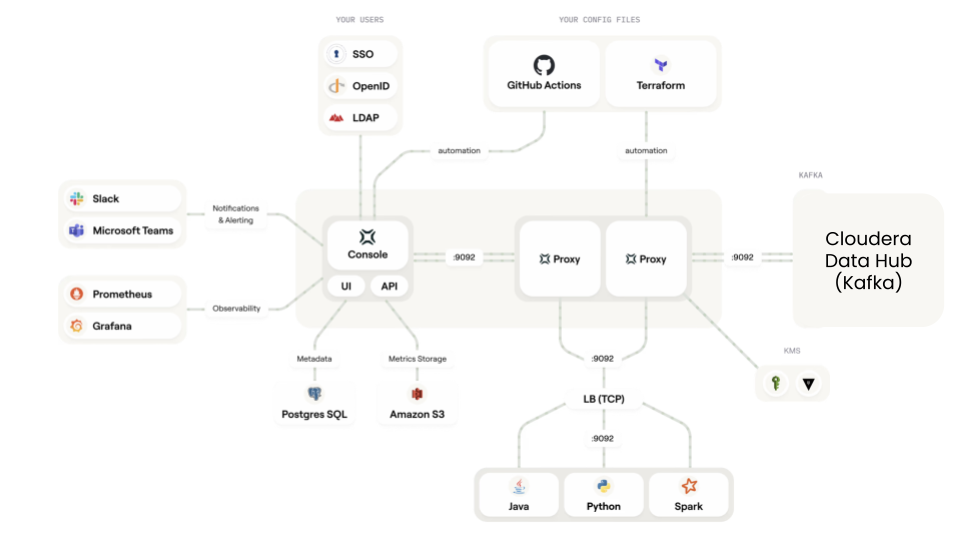
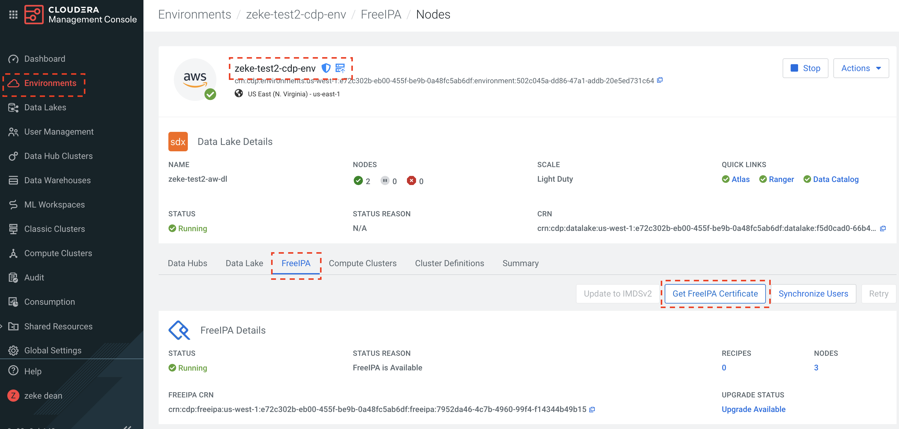
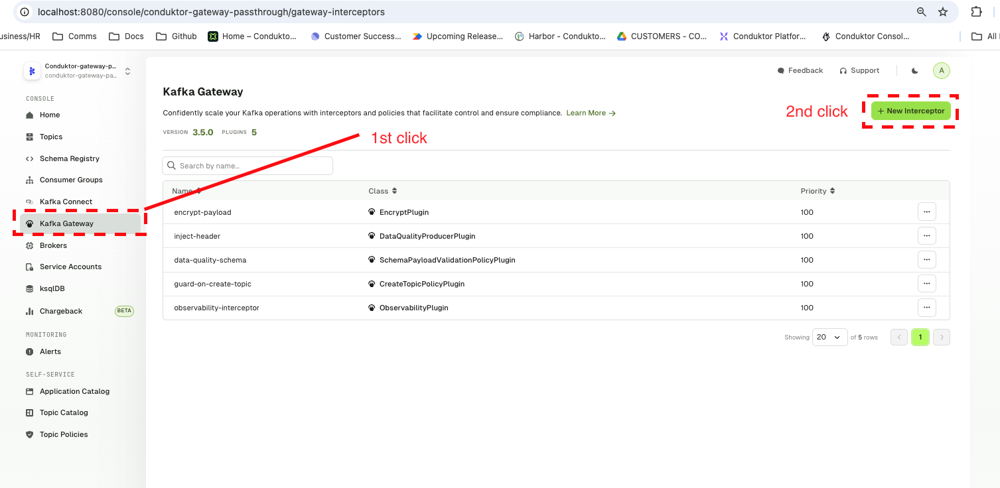
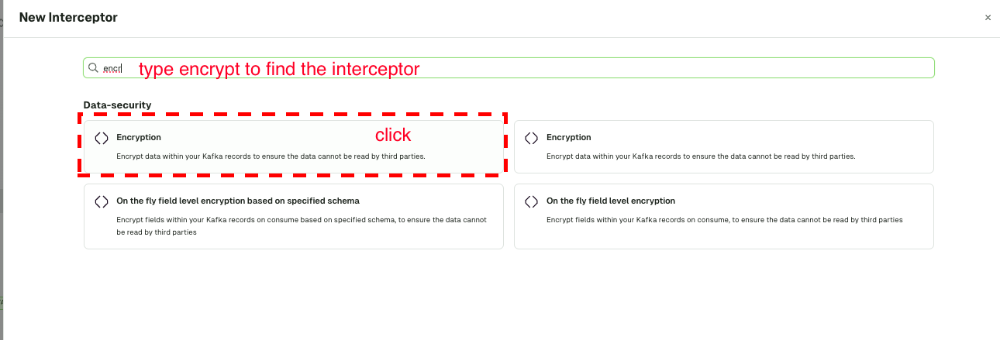
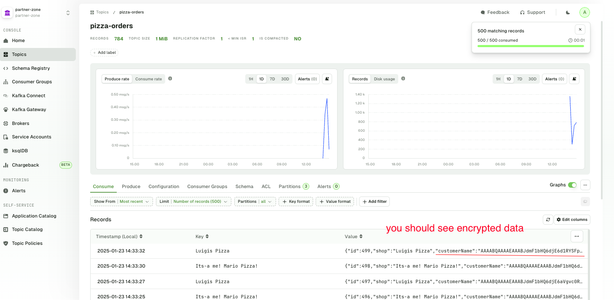
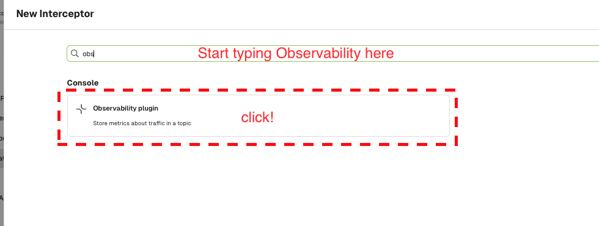
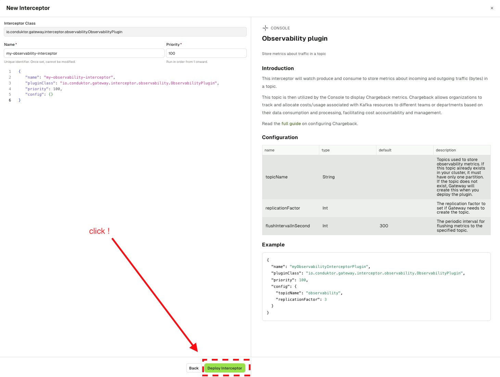
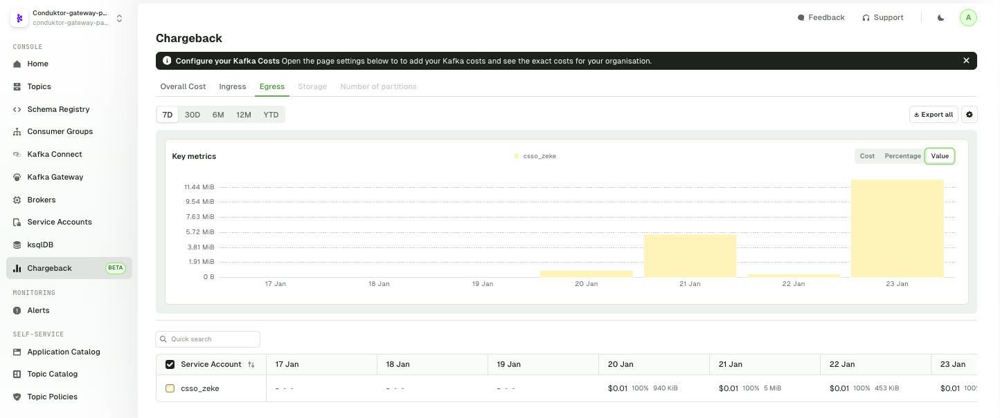

# Cloudera + Conduktor



[Link to this page](https://github.com/conduktor/conduktor-cloudera-quicklstart-demo)

## Prework

* Download the certificates from cloudera


* Convert the certificates to a JKS file
```
keytool -import -keystore zeke-test2-cdp-env.jks -alias zeke-test2-cdp-env -file zeke-test2-cdp-env.crt
```

* Open up the firewalls on the kafka brokers and the schema registry on the cloudera platform
**screenshots from aws**

*  [add the certs to you console environment](https://docs.conduktor.io/platform/get-started/configuration/ssl-tls-configuration/#configure-custom-truststore-on-conduktor-console) (the demo will automate this for you) 

* You will need set up the broker ids
** to figure out the broker ids of the kafka instances and set up the certificates. First you will need to edit *line 12* in `start.sh` 
** next you will need to configure the network alias of the instances in the docker-compose.yml file

```
          - broker-passthroughmain1546337502.conduktor-gateway-passthrough.sni-demo.local
          - broker-passthroughmain1546337526.conduktor-gateway-passthrough.sni-demo.local
          - broker-passthroughmain1546337550.conduktor-gateway-passthrough.sni-demo.local
```

## How to start ?

Set the following Environment Variables

| Name                       |     Recommended Values                                                                                                                               |
| ---------------------------|-------------------------------------------------------------------------------------------------------------------------------------------- |
| `CLOUDERA_PASSWORD`  |     cloudera password                                                                                           |
| `CLOUDERA_USER`           | cloudera csso user                                                                                                      |
| `CLOUDERA_JKS`            |     jks file you would download and set up in the above instructions |
| `CLOUDERA_BOOTSTRAP_SERVERS` | set up the cloudera bootstrap servers |
| ---------------------------|-------------------------------------------------------------------------------------------------------------------------------------------- |

Execute the following command: 
```
./start.sh
```

Wait a bit and you should get your Console up and running on [http://localhost:8080].


#### Possible logins
| Login          | Password      | Role   | Local |
|----------------|---------------|--------|-------|
| admin@demo.dev | adminP4ss!      | Admin  | Yes   |
| alice          | alice-secret  | Member | LDAP  |
| bob            | bob-secret    | Member | LDAP  |


## Enable the data generator

[You can deploy a data generator here](https://github.com/meticulo3366/kafka-data-generator) 

Please configure the data generator to run through the gateway

##Self Service demo

[You can follow everything here on this webpage and apply it to the cloudera demo](https://docs.conduktor.io/platform/guides/self-service-quickstart/)

## Enternal Data Sharing

*you will need to edit the CSSO user for your own cloudera environment to correctly run this demo. please edit the file `resources/external_virtual_cluster`*

you will need to deploy a partner zone

1. login to the conduktor cli instance

`docker compose exec -it conduktor-ctl /bin/sh`

2. apply the resources

`conduktor apply -f resources/external_virtual_cluster`

## Encryption Demo

We will be encrypting the pizza Orders. We need to deploy the interceptors on the partner zone




 

Fill in the interceptor below or copy and paste from `gateway-interceptors/encrypt-pizza-orders.json`


Deploy it!

See your data encrypted



## Chargeback Demo

You will need to login to the console and deploy the chargeback intercepter, you can follow the below steps






Once you have deployed the intercepter, make sure that you have all of your application traffic running through the Gateway



## Data Schema Validation

You can use conductor to validate data schemas. If you take a look at the file `schema_validation_cloudera.avsc` you will see that we have field validation (age range, country of origin) is all there

## How to stop the environment?

Execute the following command: 
```sh
$ ./stop.sh
```

